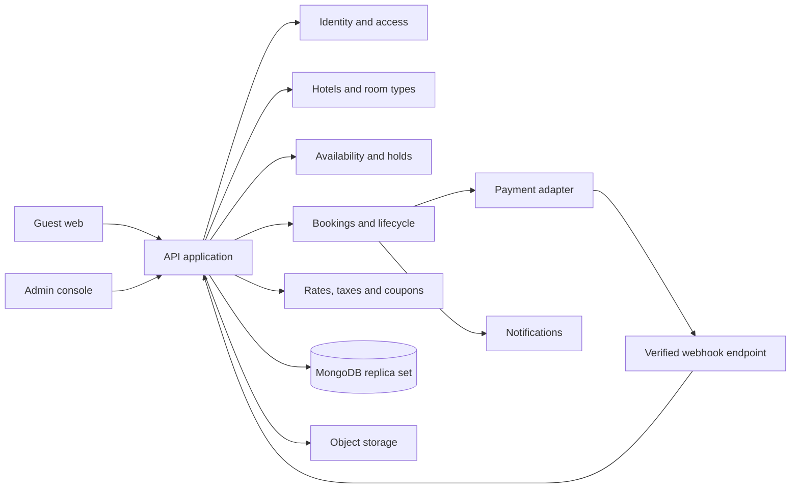

# Architecture

## Shape

Use a **modular monolith**: responsive React guest/admin web clients styled with Tailwind CSS call a versioned NestJS REST API. Domain modules own their business logic and persistence. MongoDB with Mongoose is the selected persistence stack. Run MongoDB as a replica set to support multi-document transactions; use conditional atomic updates and unique indexes to protect inventory. See [tech stack](./05-tech-stack.md) and [decision log](./20-decision-log.md).

## Domain modules

Identity, users, hotels, room types, rates, inventory/blocks, search, pricing, holds, bookings, payments/refunds, reviews, notifications, reports, audit.

## Booking transaction boundary

The API validates input, derives the per-night rate and total, then in a MongoDB transaction claims inventory for every night or claims none. Persist per-night inventory documents and use conditional updates that only succeed when `held + confirmed + blocked + requested <= total`; create the hold and booking snapshot in the same transaction. A unique idempotency key prevents duplicate creation. Payment is performed outside the database transaction; a verified callback then atomically confirms the booking if the hold remains valid. If payment succeeds after expiry, route to reconciliation/refund; never silently oversell. Multi-document transactions require a replica set (including local development).

## External service boundaries

Use adapters for payment, email/SMS, and media. Verify webhook signatures against raw request bytes. Record gateway references and state transitions. Notifications are retriable and must not determine booking correctness.

## Scaling path

Start with one API service and managed database. Add a durable job queue for expiry/notifications when needed. Add caches only for read data with a clear invalidation strategy; availability must not rely on stale cache as its authority.
